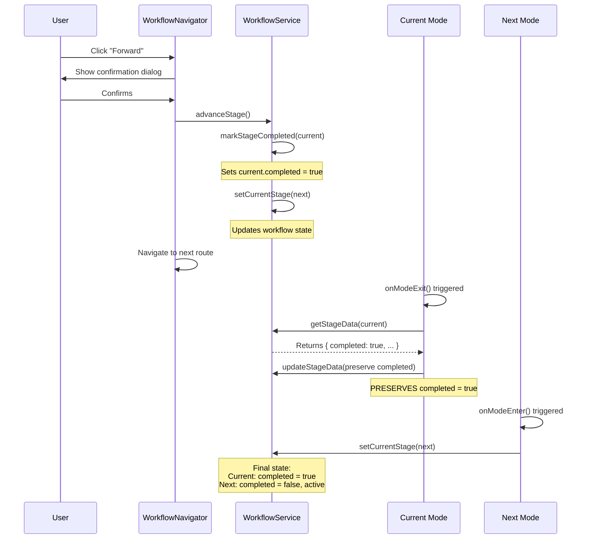

# Workflow Completion Pattern - Architecture & Implementation

## Problem Statement

Initially, workflow stages were not being marked as completed even after user confirmation. The issue was that modes were overwriting the `completed` status in their `onModeExit` handlers, causing stages to remain "pending" even after advancement.

## Root Cause

The workflow had **two conflicting sources of truth** for completion status:

1. **WorkflowService**: Marks stages as completed during `advanceStage()`
2. **Mode onModeExit**: Was setting `completed` based on mode-specific logic

### Example of the Conflict:

```typescript
// User clicks "Forward" from segmentation → planning
// Step 1: WorkflowService marks segmentation as completed
workflowService.advanceStage();  // Sets segmentation.completed = true

// Step 2: Navigation triggers segmentation onModeExit
onModeExit() {
  // This OVERWRITES the completed status!
  updateStageData('segmentation', {
    completed: segmentations.length > 0  // Might be false!
  });
}
```

## Solution: Single Source of Truth Pattern

### Principle

**The WorkflowService is the ONLY authority on completion status.**

Modes are responsible for:
- ✅ Saving their stage-specific data
- ✅ Preserving the existing `completed` status
- ❌ NOT deciding if the stage is complete

### Implementation

#### 1. WorkflowService Handles Completion

**File**: `Viewers/platform/app/src/lifesync/services/WorkflowService/WorkflowService.ts`

```typescript
public advanceStage(): { success: boolean; nextStage?: WorkflowStage; error?: string } {
  // ... validation ...
  
  const nextStage = this.getNextStage();
  
  // Mark current stage as completed (SINGLE SOURCE OF TRUTH)
  this.markStageCompleted(this._state.currentStage);
  
  // Move to next stage
  this.setCurrentStage(nextStage);
  
  return { success: true, nextStage };
}

public markStageCompleted(stage: WorkflowStage): void {
  console.log(`✅ [WorkflowService] Marking stage as completed: ${stage}`);
  this.updateStageData(stage, { completed: true });
}
```

#### 2. Modes Preserve Completion Status

**Pattern for All Modes**:

```typescript
onModeExit({ servicesManager }) {
  if (surgicalWorkflowService) {
    // Get current stage data to preserve 'completed' status
    const currentStageData = surgicalWorkflowService.getStageData('stageName');
    
    surgicalWorkflowService.updateStageData('stageName', {
      // ✅ PRESERVE existing completed status
      completed: currentStageData.completed,
      
      // ✅ Save mode-specific data
      myModeData: ...,
      timestamp: Date.now(),
    });
  }
}
```

**Implemented in:**
- ✅ `Viewers/modes/basic/src/index.tsx`
- ✅ `Viewers/modes/segmentation/src/index.tsx`
- ✅ `Viewers/modes/planner/src/index.ts`

## Workflow Completion Flow



## Benefits of This Pattern

### 1. Single Source of Truth
- Only WorkflowService determines completion
- No conflicts between service and modes
- Clear responsibility boundaries

### 2. Consistent Behavior
- All stages follow the same pattern
- Predictable completion logic
- Easy to understand and maintain

### 3. Event-Driven Updates
- WorkflowService emits events when state changes
- UI components listen and update automatically
- React Context propagates changes

### 4. Factory-Ready Design
- All modes follow the same template
- Easy to create new workflow stages
- Consistent interface across modes

## Event-Driven Architecture

### WorkflowService Events

```typescript
export const WORKFLOW_EVENTS = {
  STAGE_CHANGED: 'workflow:stage_changed',
  DATA_UPDATED: 'workflow:data_updated',
  VALIDATION_CHANGED: 'workflow:validation_changed',
  WORKFLOW_RESET: 'workflow:reset',
};
```

### Event Flow

```typescript
// 1. Service updates state
workflowService.markStageCompleted('segmentation');

// 2. Service emits event
this._emit(WORKFLOW_EVENTS.DATA_UPDATED, {
  stage: 'segmentation',
  stageData: { completed: true, ... }
});

// 3. WorkflowContext listens
workflowContext.subscribe(WORKFLOW_EVENTS.DATA_UPDATED, (data) => {
  setWorkflowState(workflowService.getState());
});

// 4. React re-renders
WorkflowNavigator → StageIndicator → UI updates
```

### UI Components Listen to Events

**File**: `Viewers/platform/app/src/lifesync/contexts/WorkflowContext.tsx`

```typescript
useEffect(() => {
  // Subscribe to data updates
  const unsubDataUpdated = service.subscribe(
    WORKFLOW_EVENTS.DATA_UPDATED,
    (data: any) => {
      console.log('📢 [WorkflowProvider] Data updated event received:', data);
      setWorkflowState(service.getState());  // ← Triggers React re-render
    }
  );
  
  return () => {
    unsubDataUpdated();  // Cleanup
  };
}, [service]);
```

## StageIndicator UI Updates

**File**: `Viewers/platform/app/src/lifesync/components/WorkflowNavigator/StageIndicator.tsx`

### Visual Status Priority

```typescript
// Priority: Error > Active > Completed > Pending
if (hasError) {
  return 'bg-red-700 text-white ring-2 ring-red-400';  // ❌ Error
}
if (isActive && !isCompleted) {
  return 'bg-blue-600 text-white ring-2 ring-blue-400';  // 🔵 Working
}
if (isActive && isCompleted) {
  return 'bg-blue-600 text-white ring-2 ring-green-400';  // 🔵 Reviewing
}
if (isCompleted && !isActive) {
  return 'bg-green-700 text-white';  // ✅ Done
}
return 'bg-gray-700 text-gray-400';  // ⏸️ Pending
```

### Status Icons

```typescript
const getStatusIcon = () => {
  if (hasError) return '⚠️';
  if (isCompleted) return '✅';
  if (isActive) return '🔵';
  if (isPending) return '⏸️';
  return '○';
};
```

## Factory Pattern for New Stages

### Template for Creating New Workflow Stages

```typescript
// 1. Define stage in types
export type WorkflowStage = 
  | 'beginning' 
  | 'segmentation' 
  | 'planning'
  | 'reporting'     // ← Add new stage
  | 'review';

// 2. Add route
export const STAGE_ROUTES: Record<WorkflowStage, string> = {
  // ... existing routes
  reporting: '/reporting',  // ← Add route
};

// 3. Add label
export const STAGE_LABELS: Record<WorkflowStage, string> = {
  // ... existing labels
  reporting: 'Report Generation',  // ← Add label
};

// 4. Update stage order
export const STAGE_ORDER: WorkflowStage[] = [
  'beginning',
  'segmentation',
  'planning',
  'reporting',    // ← Add to order
  'review',
];
```

### Mode onModeExit Template

```typescript
onModeExit: ({ servicesManager }) => {
  const { surgicalWorkflowService, /* other services */ } = servicesManager.services;
  
  if (surgicalWorkflowService) {
    try {
      // 1. Get current stage data (PRESERVES completed status)
      const currentStageData = surgicalWorkflowService.getStageData('myStage');
      
      // 2. Collect mode-specific data
      const myData = {
        // Your stage-specific data here
        dataField1: value1,
        dataField2: value2,
      };
      
      // 3. Update stage data (PRESERVE completed)
      surgicalWorkflowService.updateStageData('myStage', {
        completed: currentStageData.completed,  // ← ALWAYS preserve
        ...myData,
        timestamp: Date.now(),
      });
      
      console.log('✅ [MyMode] Stage data saved (completed:', currentStageData.completed, ')');
    } catch (error) {
      console.error('❌ [MyMode] Error saving stage data:', error);
    }
  }
}
```

## Testing the Completion Flow

### Manual Test Steps

1. **Start in Basic Mode**
   - Stage indicator: Beginning = 🔵 Blue (active)
   - Others = ⏸️ Gray (pending)

2. **Click "Forward" → Segmentation**
   - Confirm dialog
   - After navigation:
     - Beginning = ✅ Green (completed)
     - Segmentation = 🔵 Blue (active)

3. **Create Segmentation → Click "Forward" → Planning**
   - Confirm dialog
   - After navigation:
     - Beginning = ✅ Green (completed)
     - Segmentation = ✅ Green (completed)
     - Planning = 🔵 Blue (active)

4. **Click "Back" → Segmentation**
   - No confirmation needed for going back
   - After navigation:
     - Beginning = ✅ Green (completed)
     - Segmentation = 🔵 Blue with green ring (active & completed)
     - Planning = ⏸️ Gray (pending again)

### Console Logs to Verify

```
✅ [WorkflowService] Marking stage as completed: segmentation
💾 [SegmentationMode] Saving segmentation reference to workflow: {count: 1}
✅ [SegmentationMode] Workflow reference saved (completed: true)
📢 [WorkflowProvider] Data updated event received: {stage: 'segmentation', ...}
🎯 [StageIndicator] Rendering: segmentation {isActive: false, isCompleted: true, ...}
```

## Debugging

### Check Workflow State

```javascript
// In browser console
const workflow = window.servicesManager?.services?.surgicalWorkflowService;
console.log('Current state:', workflow?.getState());
console.log('Segmentation data:', workflow?.getStageData('segmentation'));
```

### Check Completion Status

```javascript
const state = workflow?.getState();
Object.entries(state.stages).forEach(([stage, data]) => {
  console.log(`${stage}: completed = ${data.completed}`);
});
```

## Summary

✅ **Completion Flow**:
1. User confirms advancement
2. WorkflowService marks current stage completed
3. Navigation happens
4. Mode exits, saves data, PRESERVES completed status
5. UI updates automatically via events

✅ **Single Source of Truth**:
- WorkflowService = authority on completion
- Modes = data savers only

✅ **Event-Driven**:
- Service emits events
- Context listens and updates
- React re-renders UI

✅ **Factory-Ready**:
- Consistent pattern across all modes
- Easy to add new stages
- Template for onModeExit

---

**Status**: ✅ Implemented and Working  
**Last Updated**: December 22, 2025

